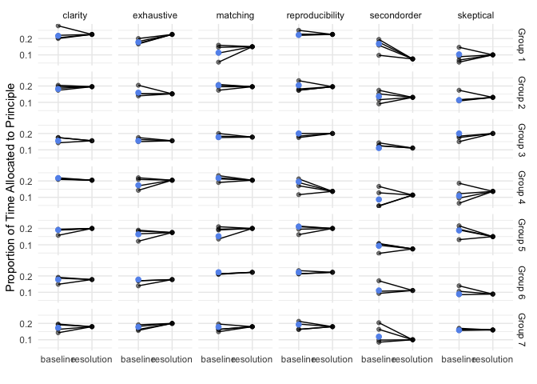

<!-- README.md is generated from README.Rmd. Please edit that file -->

# jds-alignment-analysis

<!-- badges: start -->
<!-- badges: end -->

This repository contains data and code for the paper [Quantifying the
Alignment of a Data Analysis between Analyst and
Audience](https://arxiv.org/abs/2312.07616) by Lucy D’Agostino McGowan,
Roger D. Peng, Stephanie C. Hicks.

### Case Study from Section 4

``` r
library(tidyverse)
dat <- read_csv("data.csv")
dat <- dat |>
  mutate(ind_total = rowSums(across(contains("individual"))),
         across(contains("individual"), ~.x / ind_total),
         grp_total = rowSums(across(contains("group"))),
         across(contains("group"), ~.x / grp_total),
         cons_total = rowSums(across(contains("consumer"))),
         across(contains("consumer"), ~.x / cons_total))


group_means <- dat |>
  mutate(grp = glue::glue("Group {grp}")) |>
  group_by(grp) |>
  summarise(across(matching_group:reproducibility_group,
                   ~ mean(.x, na.rm = TRUE))) |>
  pivot_longer(
    cols = matching_group:reproducibility_group,
    names_to = c(".value", "part"),
    names_pattern = "(.*)_(.*)"
  ) |>
  pivot_longer(
    cols = matching:reproducibility
  )
dat |>
  mutate(grp = glue::glue("Group {grp}")) |>
  pivot_longer(
    cols = matching_individual:reproducibility_consumer,
    names_to = c(".value", "part"),
    names_pattern = "(.*)_(.*)"
  ) |>
  pivot_longer(
    cols = matching:reproducibility
  ) |>
  filter(part != "group") |>
  mutate(part = case_when(part == "individual" ~ "baseline",
                          part == "consumer" ~ "resolution")) -> dat_long

## Figure 2 ----

dat_long |>
  ggplot(aes(x = part, y = value)) +
  geom_line(aes(group = ID)) +
  geom_point(alpha = 0.5) +
  geom_point(data = group_means, aes(x = "baseline", y = value), 
             color = "cornflower blue", size = 2) +
  facet_grid(vars(grp), vars(name)) +
  xlab("") +
  ylab("Proportion of Time Allocated to Principle") + 
  theme_minimal()
```

<!-- -->

``` r

## Table 2 ----

dat |>
  mutate(grp = glue::glue("Group {grp}")) |>
  group_by(grp) |>
  summarise(across(matching_group:reproducibility_group,
                   ~ mean(.x, na.rm = TRUE)),
            across(matching_consumer:reproducibility_consumer,
                   ~ mean(.x, na.rm = TRUE)),
            diff_matching = matching_group - matching_consumer,
            diff_exhaustive = exhaustive_group - exhaustive_consumer,
            diff_skeptical = skeptical_group - skeptical_consumer,
            diff_secondorder = secondorder_group - secondorder_consumer,
            diff_clarity = clarity_group - clarity_consumer,
            diff_reproducibility = reproducibility_group - reproducibility_consumer
            ) |>
  select(grp, starts_with("diff")) |>
  knitr::kable(digits = 3)
```

| grp | diff_matching | diff_exhaustive | diff_skeptical | diff_secondorder | diff_clarity | diff_reproducibility |
|:---|---:|---:|---:|---:|---:|---:|
| Group 1 | -0.036 | -0.048 | 0.003 | 0.093 | -0.009 | -0.003 |
| Group 2 | 0.009 | 0.007 | -0.017 | 0.006 | -0.014 | 0.009 |
| Group 3 | 0.000 | 0.000 | 0.000 | 0.000 | 0.000 | 0.000 |
| Group 4 | 0.013 | -0.031 | -0.028 | -0.027 | 0.013 | 0.059 |
| Group 5 | -0.048 | -0.011 | 0.038 | 0.019 | -0.009 | 0.011 |
| Group 6 | 0.000 | 0.000 | 0.000 | 0.000 | 0.000 | 0.000 |
| Group 7 | -0.002 | -0.022 | -0.002 | 0.019 | -0.007 | 0.013 |
